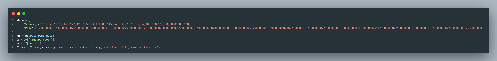
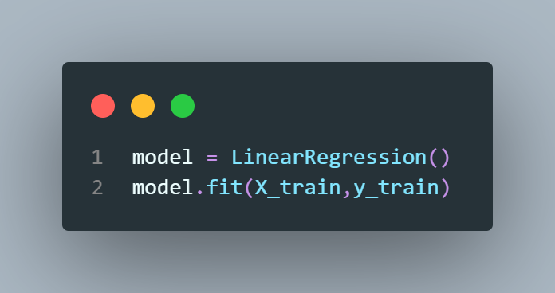
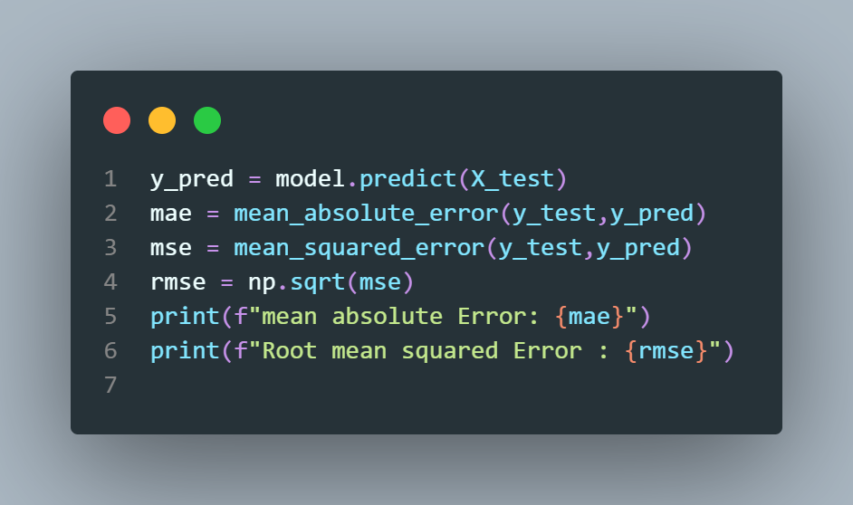
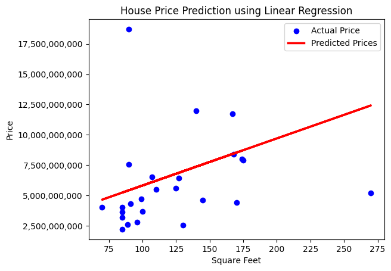

# House Price Prediction with Linear Regression

## Project Overview

This project implements a simple machine learning model to predict apartment prices based on their area (square feet) using Linear Regression. It demonstrates data preparation, model training, prediction, and visualization using Python.

## Dataset

The dataset consists of 25 apartments.

The data includes:

- Square Feet (Area) of each apartment
- Price

## Technologies and Libraries

- Python 3.x
- Pandas — for data manipulation
- NumPy — for numerical operations
- Matplotlib — for data visualization
- Scikit-learn — for building and evaluating the Linear Regression model

## Features

- Data preprocessing using Pandas
- Linear Regression model training
- House price prediction
- Model evaluation using MAE, MSE, and RMSE
- Data visualization using Matplotlib

## Project Screenshots

### Dataset

### Model Training

### Prediction

### Output Graph

## Output

The model predicts house prices based on apartment area and visualizes the relationship between area and price using a regression line.

## Author

**Patibandla Jaswanth**
